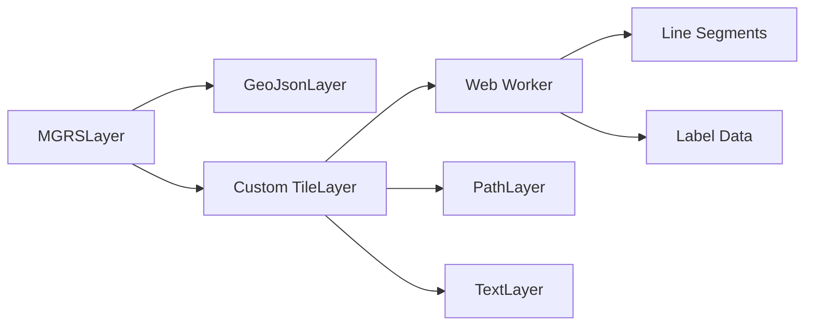

# MGRS Layer Implementation Plan

Build an accurate, performant MGRS visualization layer for Deck.gl using a hybrid rendering strategy.

## Data Source

> [!NOTE]
> **GZD Data**: Using NGA (National Geospatial-Intelligence Agency) MGRS shapefiles from [earth-info.nga.mil](https://earth-info.nga.mil). One-time conversion to GeoJSON required.

---

## Architecture Overview



| Level | Strategy | Zoom Range | Data Source |
|-------|----------|------------|-------------|
| GZDs | Static GeoJSON | < 6 | `gzds.json` |
| 100km | Dynamic Tiling | 6-9 | Worker-generated |
| 10km | Dynamic Tiling | 10-12 | Worker-generated |
| 1km/100m | Dynamic Tiling | 13+ | Worker-generated |

---

## Proposed Changes

### Dependencies

Install required packages:

```bash
pnpm add deck.gl @deck.gl/core @deck.gl/layers @deck.gl/geo-layers @deck.gl/react
pnpm add mgrs proj4
pnpm add -D @types/proj4
```

> [!NOTE]
> Using pure Deck.gl with `MapView` — no Mapbox dependency required.

---

### Core Worker Logic

#### [NEW] [mgrs.worker.ts](file:///c:/Users/shawn/code/mgrs/mgrs/src/workers/mgrs.worker.ts)

Web Worker that generates MGRS grid lines and labels given tile bounds:

- **Input**: `{ x, y, z, zoom }` tile coordinates
- **Processing**:
  1. Convert tile XYZ → lat/lon bounds
  2. Determine overlapping UTM zones
  3. For each zone, generate grid lines at appropriate resolution
  4. Project UTM coordinates → WGS84 via `proj4`
  5. Clip lines at zone boundaries
- **Output**: `Float32Array` of line segments + label positions

---

### Deck.gl Layer

#### [NEW] [MGRSLayer.ts](file:///c:/Users/shawn/code/mgrs/mgrs/src/layers/MGRSLayer.ts)

Composite layer extending `TileLayer`:

- Manages worker pool for tile generation
- Renders sub-layers:
  - `GeoJsonLayer` for static GZD polygons (zoom < 6)
  - `PathLayer` for grid lines (zoom-dependent width/color)
  - `TextLayer` for labels (NATO placement: bottom-left)
- Handles zoom-based resolution switching

---

### Application Integration

#### [MODIFY] [App.tsx](file:///c:/Users/shawn/code/mgrs/mgrs/src/App.tsx)

Replace default content with:

- Pure Deck.gl with `MapView` controller
- `MGRSLayer` overlay
- Initial viewport centered on a useful location

---

### Supporting Files

#### [NEW] [mgrs.ts](file:///c:/Users/shawn/code/mgrs/mgrs/src/types/mgrs.ts)

Shared TypeScript interfaces:

- `TileRequest`, `TileResponse`, `GridLine`, `GridLabel`
- `MGRSLayerProps`

#### [NEW] [projection.ts](file:///c:/Users/shawn/code/mgrs/mgrs/src/utils/projection.ts)

Projection utilities:

- `tileToLatLonBounds(x, y, z)` — Convert tile coordinates to WGS84 bounds
- `utmToLatLon(easting, northing, zone, hemisphere)` — Project UTM to WGS84
- `getUTMZonesForBounds(bounds)` — Determine which UTM zones overlap given bounds

#### [NEW] [gzds.json](file:///c:/Users/shawn/code/mgrs/mgrs/public/gzds.json)

Static GeoJSON for Grid Zone Designators (if not provided by user).

---

## Implementation Phases

### Phase 1: Foundation
- [ ] Download GZD shapefile from NGA and convert to GeoJSON → `public/gzds.json`
- [ ] Install dependencies
- [ ] Create type definitions (`src/types/mgrs.ts`)
- [ ] Create projection utilities (`src/utils/projection.ts`)

### Phase 2: Worker Implementation
- [ ] Implement `mgrs.worker.ts` with grid generation logic
- [ ] Handle UTM zone clipping at boundaries
- [ ] Optimize output with `Float32Array` for binary transfer

### Phase 3: Layer Implementation
- [ ] Create `MGRSLayer` composite layer
- [ ] Integrate static GZD layer for low zoom
- [ ] Connect dynamic tile layer to worker

### Phase 4: Visual Styling
- [ ] Implement zoom-based line styling (width/color by resolution)
- [ ] Add NATO-compliant label placement (bottom-left of square)
- [ ] Dynamic label resolution switching per zoom

### Phase 5: App Integration
- [ ] Modify `App.tsx` with Deck.gl MapView and layer
- [ ] Set initial viewport to useful location

---

## Verification Plan

### Automated Tests

> [!NOTE]
> No existing test framework detected. Will add Vitest for unit testing.

**Setup**:
```bash
pnpm add -D vitest
```

**Add to `package.json` scripts**:
```json
"test": "vitest run",
"test:watch": "vitest"
```

**Tests to create**:

1. **Projection utils** — `src/utils/__tests__/projection.test.ts`
   - `tileToLatLonBounds` accuracy for known tiles
   - UTM ↔ LatLon round-trip precision (< 1m error)
   - Zone boundary detection correctness

2. **Worker logic** — `src/workers/__tests__/mgrs.test.ts`
   - Grid generation for known tiles
   - Zone clipping correctness at zone boundaries
   - Output data structure validation

**Run command**:
```bash
pnpm test
```

---

### Manual Verification

1. **Start dev server**: `pnpm dev`
2. **Visual checks at different zoom levels**:
   - [ ] Zoom < 6: GZD boundaries visible (especially Norway/Svalbard irregularities)
   - [ ] Zoom 6-9: 100km grid squares with thick lines, 2-letter labels (e.g., "UJ")
   - [ ] Zoom 10-12: 10km grid with medium lines, 2-digit labels
   - [ ] Zoom 13+: 1km/100m grid with thin lines, full coordinate labels
3. **Accuracy checks**:
   - [ ] Grid lines clip correctly at UTM zone boundaries (no bleeding)
   - [ ] Labels appear in bottom-left corner of each grid square
4. **Performance**: Pan/zoom should remain smooth at 60fps

---

## File Structure

```
mgrs/src/
├── App.tsx                    # Modified - map integration
├── layers/
│   └── MGRSLayer.ts          # New - composite Deck.gl layer
├── workers/
│   └── mgrs.worker.ts        # New - grid generation worker
├── types/
│   └── mgrs.ts               # New - TypeScript interfaces
├── utils/
│   └── projection.ts         # New - coordinate utilities
mgrs/public/
└── gzds.json                 # New - static GZD boundaries
```

---

## Key Technical Decisions

| Decision | Rationale |
|----------|-----------|
| Web Worker for tile generation | CPU-intensive projection math off main thread |
| `Float32Array` output | Minimize worker → main thread serialization overhead |
| `proj4` over `mgrs` for projection | Need raw UTM control for line generation, not just string conversion |
| Composite layer pattern | Clean separation of static GZDs vs dynamic grid tiles |
| Vitest for testing | Modern, Vite-native test runner with fast HMR |
| Pure Deck.gl with MapView | No external map provider dependency |
